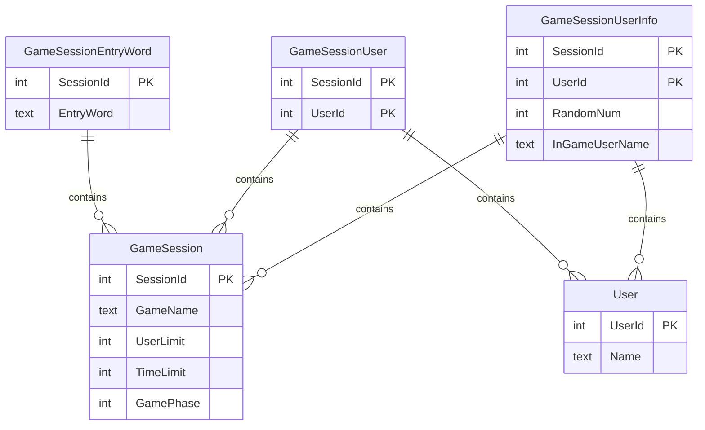

# Schema

## ref

- [cloudflare d1](https://zenn.dev/kameoncloud/articles/6264967e5fd1da)
- `wrangler d1 execute DB --local --file jrbn_init.sql`
- `wrangler d1 execute DB --remote --file jrbn_init.sql`
- `wrangler d1 execute DB --command="SELECT * FROM USER"`

## Database

