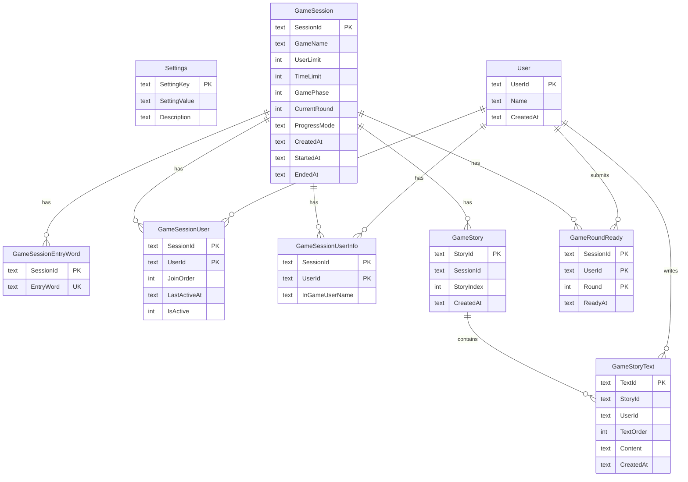

# Schema

## ref

- [cloudflare d1](https://zenn.dev/kameoncloud/articles/6264967e5fd1da)
- `wrangler d1 execute DB --local --file jrbn_init.sql`
- `wrangler d1 execute DB --remote --file jrbn_init.sql`
- `wrangler d1 execute DB --command="SELECT * FROM User"`

## Database

## ゲームフロー

1. **待機中 (GamePhase=0)**: 参加者が合言葉で参加するのを待つ
2. **執筆中 (GamePhase=1)**: 各ラウンドで全員が並行して執筆
3. **終了 (GamePhase=2)**: 全ラウンド終了、結果表示

## ゲームロジック

- N 人のプレイヤーが参加
- N 個の物語が並行して進行
- 各プレイヤーは各物語に 1 回ずつ執筆
- ローテーション例（4 人: A, B, C, D）:
  - 物語 1: A → B → C → D
  - 物語 2: B → C → D → A
  - 物語 3: C → D → A → B
  - 物語 4: D → A → B → C

## 進行モード

- `all_ready`: 全員が「完了」を押すと次のラウンドへ
- `time_limit`: 制限時間経過で強制的に次のラウンドへ
